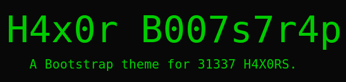

# Tilde Team Hacker Bootstrap Theme

The latest compiled CSS will be available [here](https://tilde.team/css/hacker.css)

The major changes from the original are a few tweaks to colors of code samples and font sizes.

Feel free to use and modify as you like!


This is the style used on [tilde.team](https://tilde.team).


---

Original README from [brobin](https://github.com/Brobin/hacker-bootstrap)





A Bootstrap theme for 1337 h4x0rs. Inspired by the classic green on black terminal style. This theme will make your website 1337.

Check out the [example site](http://brobin.github.io/hacker-bootstrap/)!


## Usage

You can pick up the latest [hacker.css](http://brobin.github.io/hacker-bootstrap/css/hacker.css) and reference the css in your page.

```html
<link href="css/hacker.css" rel="stylesheet">
```

**Or** you could be a real h4x0r.

**H4X0RS ONLY**

Make sure you have bootstrap and less installed (they're listed as dependencies in `package.json`). Open up your h4x0r terminal and type the following:

```bash
$ npm install
```
Then compile by using the 1337 compile script:

```bash
$ npm run build
```


## Contributing

Feel free to hack around and submit pull requests. Not every style is 100% comp1337, so any assistance is greatly appreciated.


## License

MIT
