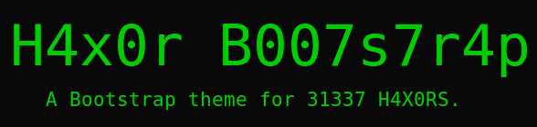

---------------------

A Bootstrap theme for 1337 h4x0rs. Inspired by the classic green on black terminal style. This theme will make your website 1337.

Check out the `example site <http://brobin.github.io/hacker-bootstrap/>`_!

-----
Usage
-----

You can pick up the latest `hacker.css <http://brobin.github.io/hacker-bootstrap/css/hacker.css>`_ and reference the css in your page.

.. code-block:: html

    <link href="css/hacker.css" rel="stylesheet">

**Or** you could be a real h4x0r.

**H4X0RS ONLY**

Make sure you have bootstrap and less installed. Open up your h4x0r terminal and type the following:

.. code-block:: bash

    $ npm install bootstrap
    $ npm install less

Then compile by using the 1337 compile script:

.. code-block:: bash

    $ ./compile.sh

------------
Contributing
------------

Feel free to hack around and submit pull requests. Not every style is 100% comp1337, so any assistance is greatly appreciated.

-------
License
-------

MIT
